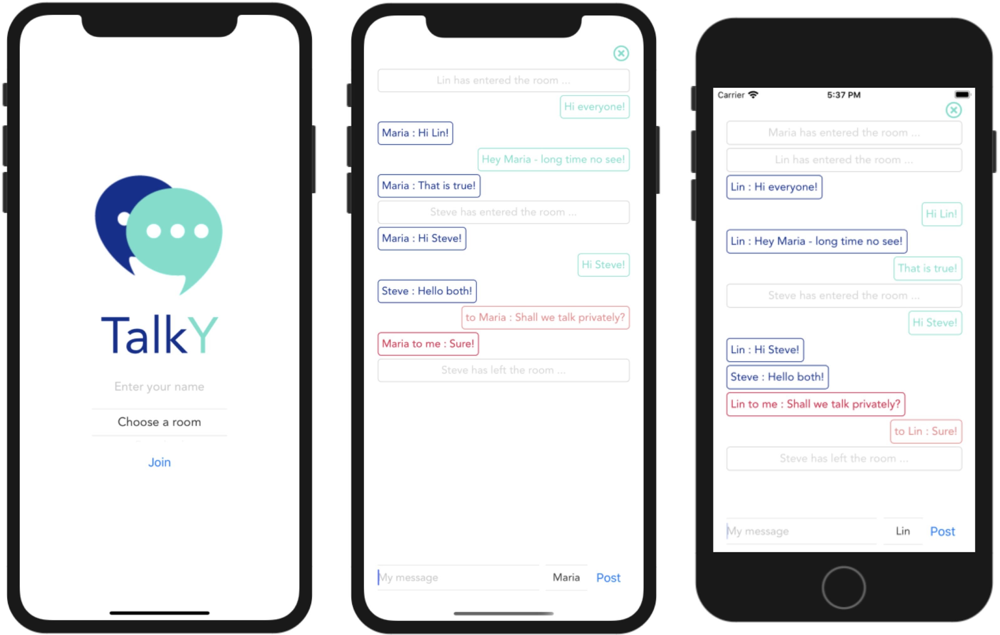
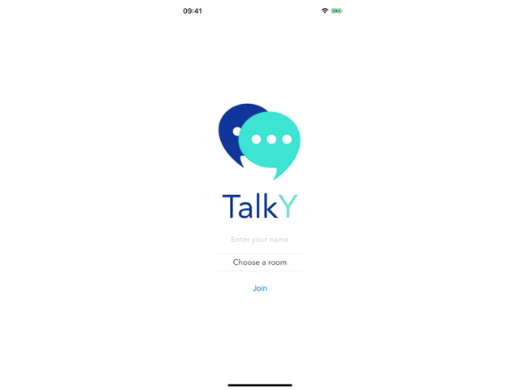

# Talky

## Description

"Talky" is a very simple chat app written in React Native. It has its own websocket back-end ([here](https://github.com/RyanLinXiang/talky-server)) and has the following features:
* different rooms (rooms can be added via back-end)
* different message types (system messages, user's messages, other's messages, private messages)
* allows private conversations via user selection

"Talky" is an ideal base to build a more comprehensive chat app.



As you can see - there are different colors for each message type. In the following a demo:



## Getting Started

"Talky" was created with Expo. In order to run the app you have to install Expo and all the dependencies (see package.json). 
The server back-end ([here](https://github.com/RyanLinXiang/talky-server)) must also be installed and referenced via a file called `wsUrl.js` which must be placed in the same directory as the App.js file.
The content of `wsUrl.js` should look like this:
```javascript
const wsUrl = "your_websocket_url";
export default wsUrl;
```

### Dependencies

```
package.json
```

### Installing

```
npm install
```

### Executing program

```
npm start
```
